# RL Control Algorithms

This repository contains implementations of control algorihms found in Sutton&Barto book. Only algorithms presented in boxes are included.

The demo package contains demonstrations of the algorithms. The env package contains gym environments used in demonstrations.

## Algorithms

### Monte Carlo (MC)

- On Policy First Visit MC 
- Off Policy MC

### Temporal Difference (TD)

- SARSA
- Q-Learning
- Double Q-Learning
- Expected Sarsa

### n-Step TD

- n-Step SARSA
- Off Policy n-Step SARSA
- n-Step Tree Backup
- Off Policy n-Step Q Sigma

### Planning

- Tabular DynaQ

### On Policy Function Approximation

- Differential Semi-Gradient SARSA
- Differential Semi-Gradient n-Step SARSA
- Episodic Semi-Gradient SARSA
- Episodic Semi-Gradient n-Step SARSA

### Eligibility Traces

- Binary Feature Linear Function Approximation SARSA

### Policy Gradients

- REINFORCE Softmax Linear MC
- REINFORCE Softmax Linear MC with Baseline
- 1-Step Actor Critic 
- Episodic Eligibility Trace Actor Critic
- Continuing Eligibility Trace Actor Critic

## Demo

### Blackjack

* Sutton&Barto Figure 5.2 - Blackjack - Monte Carlo Agent - 6M episodes

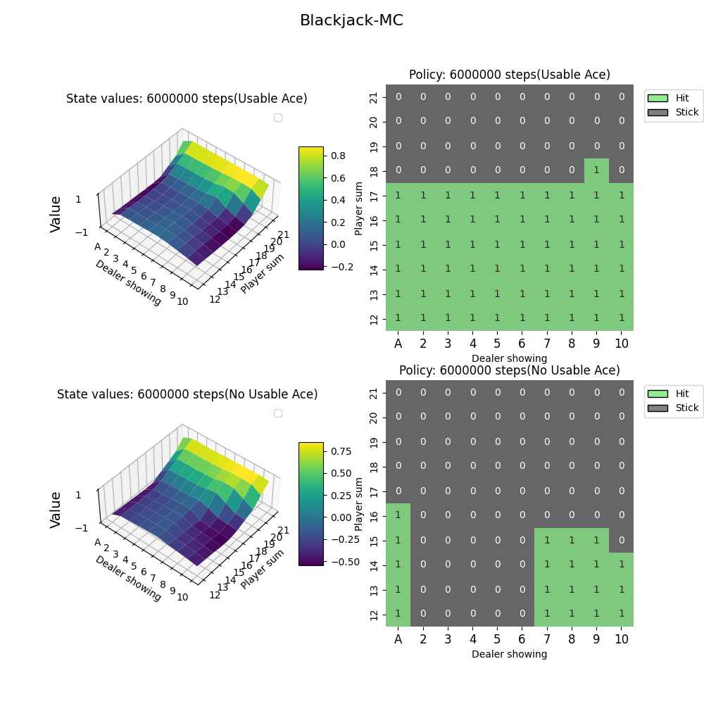

* Blackjack - Expected SARSA Agent - 6M episodes

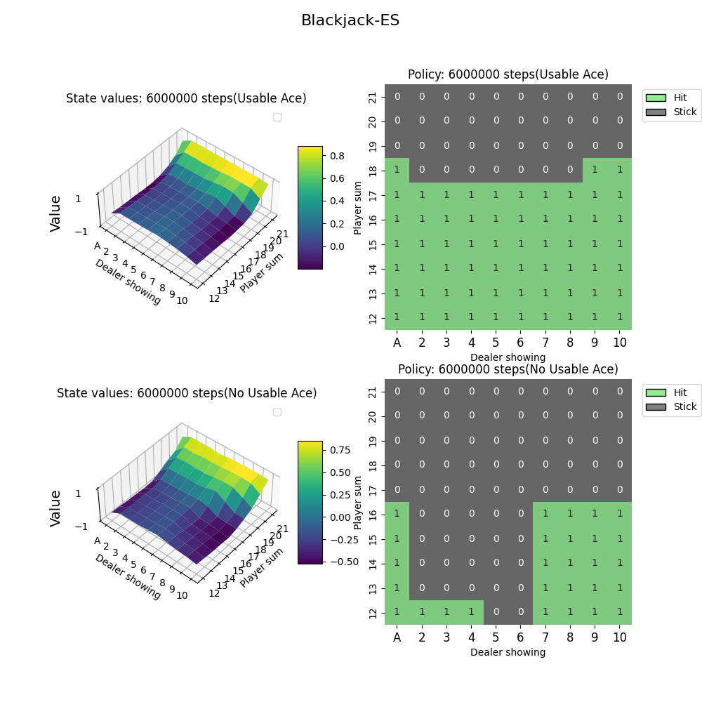

### Mountain Car

* Sutton&Barto Figure 10.1 - Episodic Semi-Gradient 5-Step Sarsa Agent

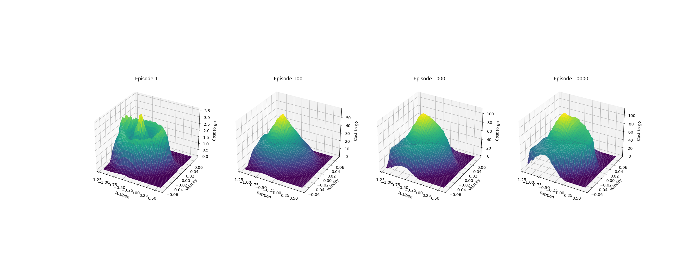

* Sutton&Barto Figure 10.2 - Episodic Semi-Gradient Sarsa Agent with different alpha parameters

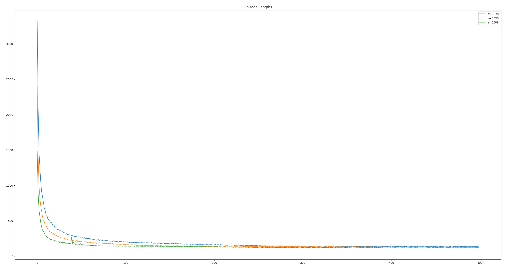

* Sutton&Barto Figure 10.3 - Episodic Semi-Gradient n-Step Sarsa Agent with different different step sizes

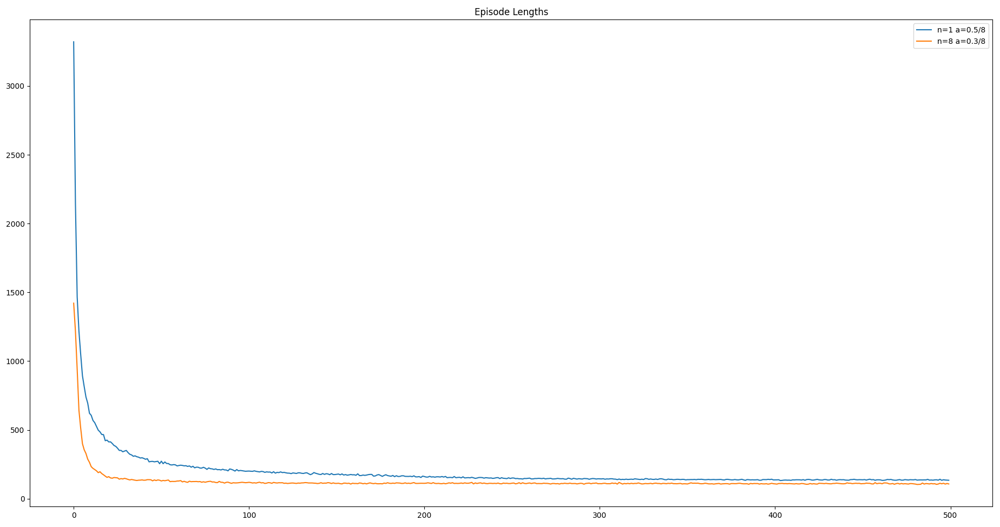

* Sutton&Barto Figure 10.4 - Episodic Semi-Gradient n-Step Sarsa Agent with different step sizes and alpha values

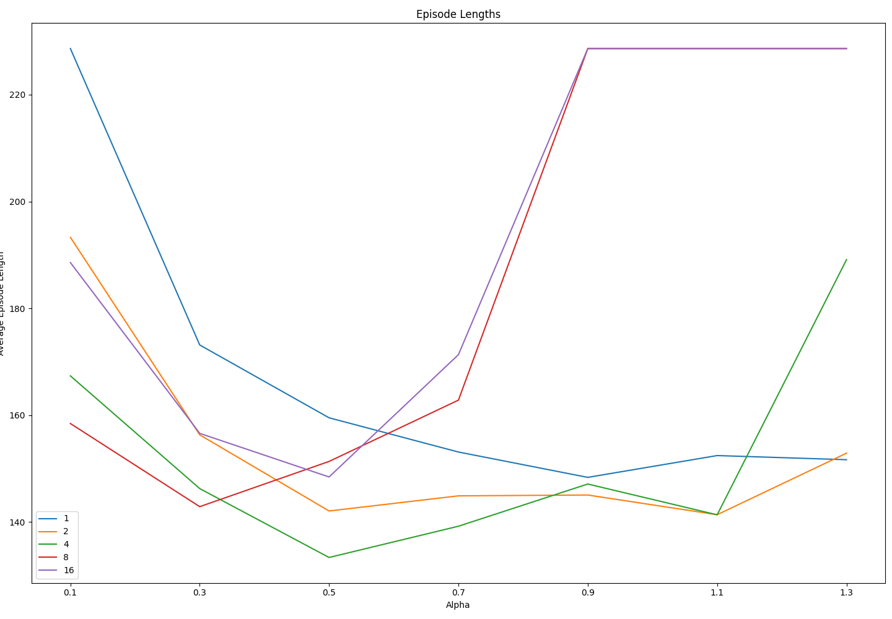

* Sutton&Barto Figure 12.10 - Binary Feature Linear Function Approximation SARSA Agent with different lambda and alpha values

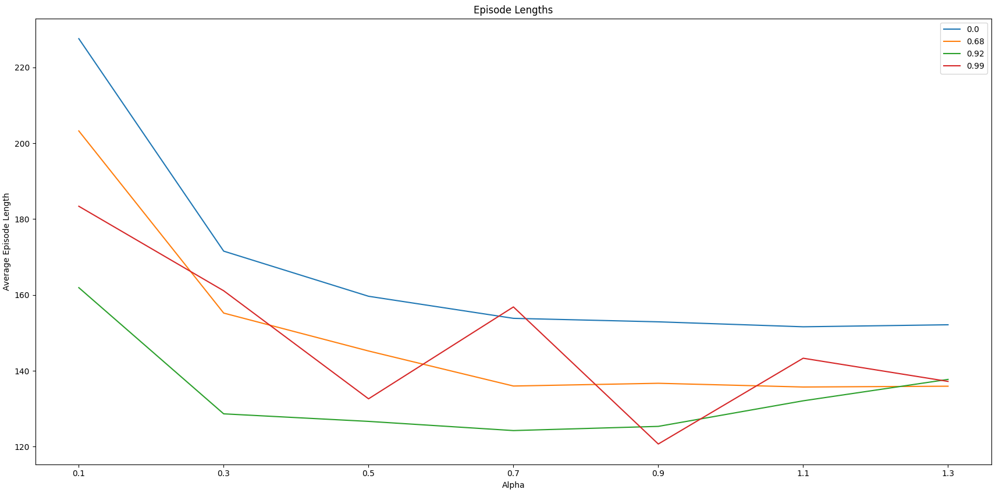

### Access Control

* Sutton&Barto Figure 10.5 - Episodic Semi-Gradient 5-Step Sarsa Agent

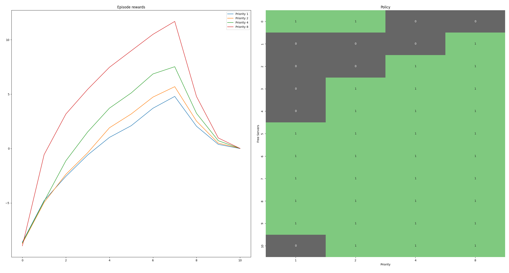

### Short Corridor Grid World

* Sutton&Barto Figure 13.1 - Total reward on episode - Reinforce softmax linear MC Agent

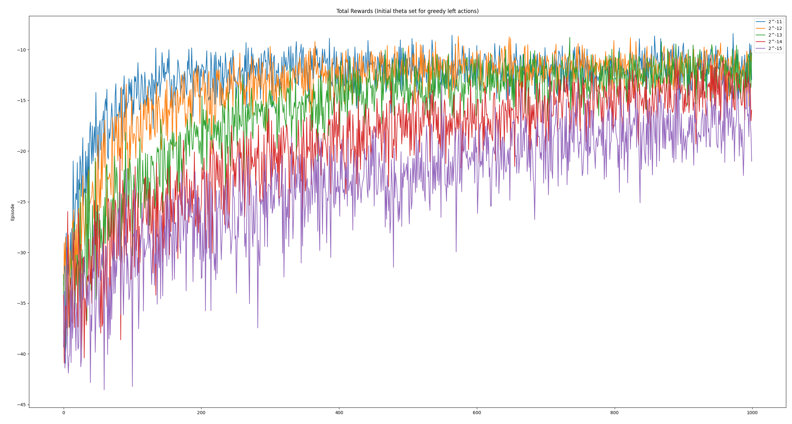

* Sutton&Barto Figure 13.2 - Total reward on episode - Reinforce softmax linear MC Agent with Baseline

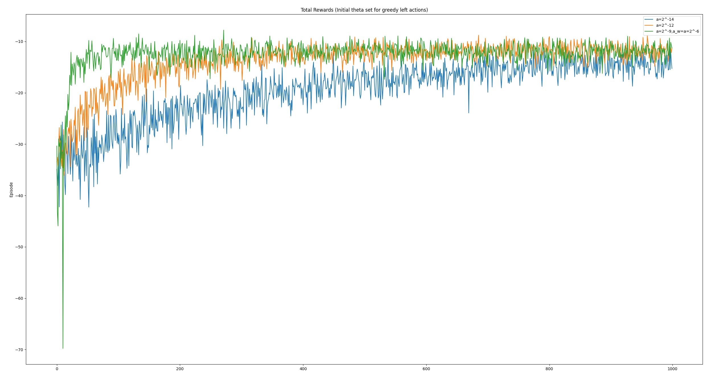

* Total reward on episode - Actor Critic

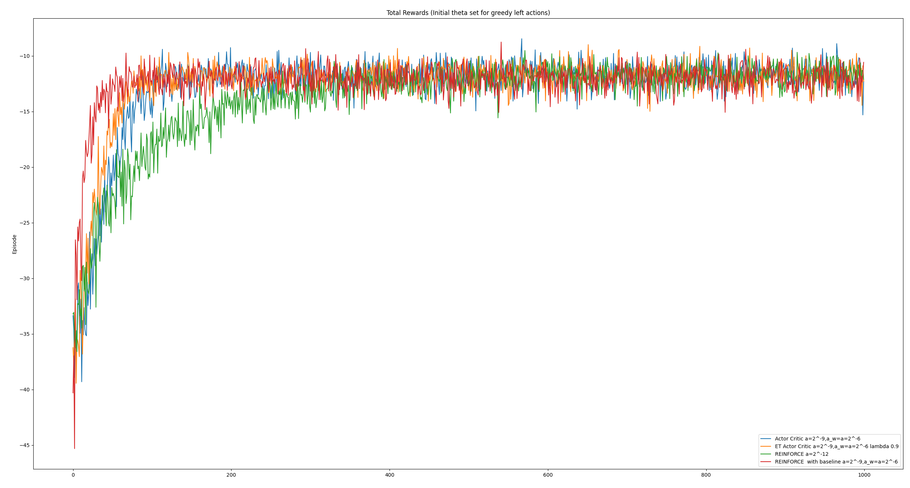
